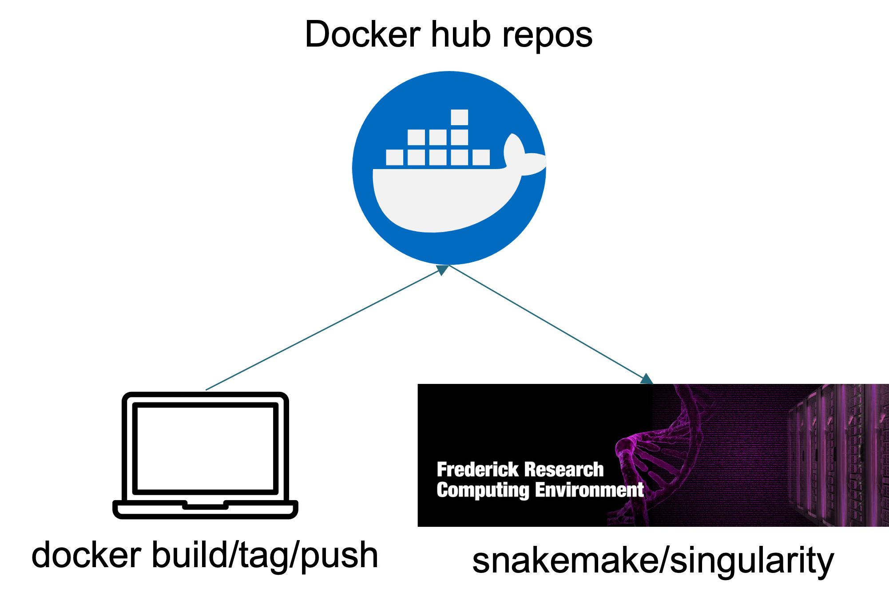

# SF_biocontainer

SF_biocontainer is a github repo with the Dockerfile used to build containers for CCRSF pipelines.

## Containerization 

### Publicly available images

Many of the popular tools have been containerized by the community, including Biocontainer community and different institutes. These resources can be found either on Docker hub or [Quay](https://quay.io/organization/biocontainers)

### CCRSF maintained images

If the tool we want to use is not containerized before, we can build the container ourselves and deposite the image on Docker hub: 

## Docker hub link for CCRSF-IFX 
CCRSFIFX maintained images can be found [here](https://hub.docker.com/repositories/ccrsfifx). 

